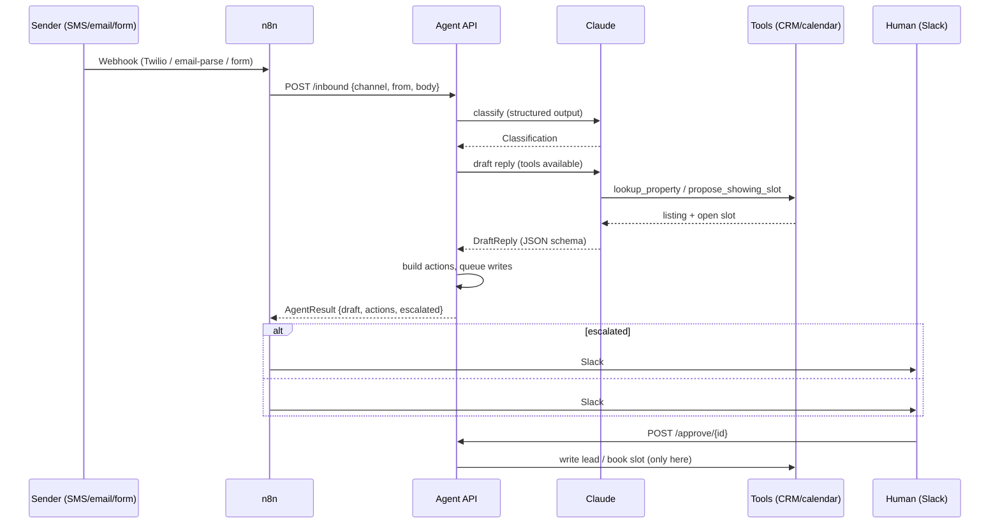

# Lead Response Agent

An AI agent that answers inbound rental inquiries (email / SMS / web form), classifies them,
drafts a reply from real listing data, proposes showing times, escalates what it can't handle,
and **never writes to the CRM without a human clicking approve**.

Built with Claude (structured outputs + tool use), FastAPI, Pydantic, and an importable n8n
workflow for routing and Slack/email notifications.

> **Demo build.** Listings, calendar, and inquiries are fictional. The "CRM" is a JSON file.
> See [Production notes](#production-notes) for what changes when this goes live.

## What it does

| Step | Mechanism | Output |
|---|---|---|
| 1. Classify | Claude structured output, validated by Pydantic | one of `availability`, `pricing`, `showing_request`, `maintenance`, `other` + confidence |
| 2. Draft reply | Claude tool loop: `lookup_property` (read-only CRM), `propose_showing_slot` (read-only calendar), `escalate` | reply text, proposed slot, property id |
| 3. Propose actions | Code, not the model | `update_lead`, `book_showing` (require approval), `escalate` (immediate, notify only) |
| 4. Approval gate | Pending queue + audit log | `POST /approve/{id}` executes the write; `POST /reject/{id}` discards it |

Policy rules enforced in code regardless of what the model says: `maintenance` and `other` are
always escalated, confidence below 0.6 is escalated, and a showing is never booked on an escalated
thread.

## Sequence



## Quickstart

```bash
git clone https://github.com/Gravityglitch/lead-response-agent && cd lead-response-agent
uv sync
cp .env.example .env            # add ANTHROPIC_API_KEY for live Claude calls
uv run uvicorn agent.api:app --reload
```

Without an API key the server falls back to a deterministic keyword-rule `FakeLLM`, so the whole
flow can be exercised offline. `GET /health` reports which backend is active.

```bash
# 1. inbound showing request
curl -s -X POST localhost:8000/inbound -H 'content-type: application/json' \
  -d '{"channel":"sms","from":"+15550100003","body":"Can I tour Maple Court 2B this weekend?"}'
# -> classification.category = "showing_request", draft.proposed_slot_id = "S-1",
#    actions = [update_lead (pending), book_showing (pending)], escalated = false

# 2. see what is waiting for a human
curl -s localhost:8000/pending

# 3. approve the booking (executes the write), reject the lead update
curl -s -X POST localhost:8000/approve/<book_showing id>
curl -s -X POST localhost:8000/reject/<update_lead id>

# 4. a maintenance message is escalated and nothing is booked
curl -s -X POST localhost:8000/inbound -H 'content-type: application/json' \
  -d '{"channel":"email","from":"tenant@example.com","body":"The furnace at Elm Plaza 12C stopped working"}'

# audit trail of every queue/approve/reject/execute event
curl -s localhost:8000/audit
```

### Endpoints

| Method | Path | Purpose |
|---|---|---|
| `POST` | `/inbound` | Webhook. Body: `{channel: email\|sms\|web_form, from, body, subject?}` |
| `GET` | `/pending` | Actions awaiting approval |
| `POST` | `/approve/{id}` | Execute a pending write |
| `POST` | `/reject/{id}` | Discard a pending write |
| `GET` | `/audit` | Append-only event log |
| `GET` | `/health` | Liveness + active LLM backend |

### n8n

Import `n8n/workflow.json`. It normalises Twilio / SendGrid-parse / form payloads into the
`/inbound` shape, calls the agent (`LEAD_AGENT_URL` env var), and branches on `escalated`:
escalations go to `#leasing-escalations` plus an on-call email; everything else posts the draft and
pending action ids to `#leasing-approvals`. Replace the `REPLACE_ME` credential ids after import.

## Eval

`evals/inquiries.jsonl` holds 20 labeled inquiries (4 per category), including deliberately
ambiguous ones (a tenant mentioning a price while reporting a leak, a vendor asking to "book 15
minutes", a fair-housing complaint).

```bash
uv run python -m agent.eval          # offline, FakeLLM
uv run python -m agent.eval --live   # Claude claude-sonnet-5-5, needs ANTHROPIC_API_KEY
```

| Backend | Accuracy | Notes |
|---|---|---|
| `FakeLLM` (keyword rules) | 20/20 | Rules were written alongside this set, so this is a regression floor, not a generalisation claim. `tests/test_eval.py` asserts >= 80%. |
| Claude `claude-sonnet-5-5` | not run in this repo | `--live` prints the same per-category table; the eval harness is identical. |

The eval is deliberately small. For a client engagement the first week's real inquiries get
labeled and become the test set, and the prompt is tuned against that, not against this file.

## Project layout

```
agent/
  models.py     Inquiry, Classification, DraftReply, Action, AgentResult
  tools.py      lookup_property, propose_showing_slot, escalate (+ JSON schemas, strict)
  llm.py        ClaudeLLM (messages.parse + tool loop) and FakeLLM
  pipeline.py   classify -> draft -> actions -> approval queue
  queue.py      pending queue, approve/reject, audit log; the only code that mutates state
  api.py        FastAPI app
  eval.py       classification accuracy report
data/           crm.json (6 listings), calendar.json (5 slots)
evals/          inquiries.jsonl
n8n/            workflow.json
tests/          19 tests, no network, ~1s
```

```bash
uv run ruff check && uv run pytest
```

## Production notes

What this demo stubs and what replaces it:

- **Channels.** `/inbound` already accepts the normalised shape; the n8n Code node maps Twilio
  (`From`/`Body`) and SendGrid Inbound Parse (`from`/`text`). Outbound replies go through
  Twilio Messages API / SendGrid Mail Send as a `send_reply` action behind the same approval
  gate, or auto-send for categories the client whitelists after a trust period.
- **CRM.** `ToolBox` is the adapter seam. AppFolio / Buildium / Rent Manager swap in behind
  `lookup_property` (read) and `ApprovalQueue._execute` (write). Keeping reads and writes in
  separate classes is deliberate: the model can only ever reach the read side.
- **Persistence.** Pending queue and audit log are in-memory; move to Postgres (one `actions`
  table with status transitions) so approvals survive restarts and are queryable.
- **Auth.** Shared-secret header on `/inbound` (n8n sets it), and `/approve` / `/reject` behind
  the client's SSO or Slack interactive buttons signed with the Slack signing secret.
- **Model.** Default `claude-sonnet-5-5`; swap via `LEAD_AGENT_MODEL`. Classification and
  drafting are separate calls so classification can be cached, batched, or run on a cheaper model
  independently. Tool schemas use `strict: true`; outputs are validated by Pydantic before any
  action is derived from them.
- **Safety rails already in code.** Policy escalation thresholds, no booking on escalated threads,
  no CRM write path reachable from the model, every state change audit-logged.
- **Observability.** Log `request_id`, token usage, and tool calls per inquiry; alert on
  escalation rate and approval-rejection rate (a rising rejection rate means the prompt drifted).

## License

MIT
